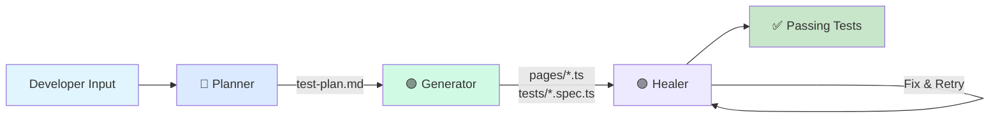

<div align="center">


# Spectra

### Full-Spectrum Test Automation

[](https://playwright.dev/)
[](https://www.typescriptlang.org/)
[](https://nodejs.org/)
[](https://opensource.org/licenses/MIT)

<br />

**One command. Complete coverage.**

Spectra uses AI agents to explore your app, generate Playwright tests, and automatically fix failures — all without manual intervention.

[Quick Start](#-quick-start) •
[How It Works](#-the-spectrum) •
[Examples](#-examples) •
[Documentation](#-documentation)

<br />



</div>

---

## ✨ Features

<table>
<tr>
<td width="50%">

### 🔵 Multi-Agent Architecture
Three specialized AI agents work in harmony:
- **Planner** - Explores your app via browser
- **Generator** - Creates Page Objects & tests
- **Healer** - Runs tests and fixes failures

</td>
<td width="50%">

### 🎯 Feature Scoping
Test specific features, not entire pages:
```bash
spectra --url http://localhost:5173 \
  --page /checkout \
  --scope "payment form"
```

</td>
</tr>
<tr>
<td width="50%">

### 🟣 Self-Healing Tests
When tests fail, the Healer agent:
- Inspects current UI state
- Identifies what changed
- Automatically fixes locators
- Re-runs until passing

</td>
<td width="50%">

### 📋 Page Object Model
Generates clean, maintainable code:
- Semantic locators (`getByRole`, `getByLabel`)
- Reusable Page Object classes
- Well-structured test files

</td>
</tr>
</table>

---

## 🌈 The Spectrum

```
┌─────────────────────────────────────────────────────────────────────────────┐
│                                                                             │
│                            PLAYWRIGHT ENGINE                                │
│   ┌─────────────────────────────┐    ┌─────────────────────────────────┐   │
│   │   Chrome DevTools Protocol  │    │  Browser Automation & Execution │   │
│   └─────────────────────────────┘    └─────────────────────────────────┘   │
│                                              ▲                              │
└──────────────────────────────────────────────┼──────────────────────────────┘
                                               │ Runs Tests
┌──────────────────────────────────────────────┼──────────────────────────────┐
│                                 LLM LAYER    │                              │
│  ┌───────────────────┐ ┌─────────────────┐ ┌─┴───────────────────┐         │
│  │ Interprets Results│ │ Understands DOM │ │ Generates Structured│         │
│  │ & Suggests Fixes  │ │ & Routes        │ │ Commands            │         │
│  └───────────────────┘ └─────────────────┘ └─────────────────────┘         │
└─────────────┬───────────────────────────────────────────┬───────────────────┘
              │                                           │
              │ Executes via MCP                          │ Sends commands
              ▼                                           ▼
┌─────────────────────────┐              ┌────────────────────────────────────┐
│  MODEL CONTEXT PROTOCOL │              │            DEVELOPER               │
│  ┌───────────────────┐  │              │  ┌────────────────────────────┐   │
│  │ Structured Command│  │              │  │  Natural Language Prompt   │   │
│  │ Interface         │  │              │  │  or Scope Definition       │   │
│  └───────────────────┘  │              │  └────────────────────────────┘   │
└─────────────────────────┘              └──────────────┬─────────────────────┘
                                                        │
                    ┌───────────────────────────────────┘
                    ▼
┌─────────────────────────────────────────────────────────────────────────────┐
│                              SPECTRA AGENTS                                 │
│                                                                             │
│  ┌───────────────────────────────────────────────────────────────────────┐ │
│  │  🟣 HEALER                                                             │ │
│  │  ┌─────────────────┐  ┌─────────────────┐  ┌─────────────────────┐   │ │
│  │  │  Applies Fixes  │  │  Executes Tests │  │  Detects Failures   │   │ │
│  │  └─────────────────┘  └─────────────────┘  └─────────────────────┘   │ │
│  └───────────────────────────────────────────────────────────────────────┘ │
│                                    ▲                                        │
│  ┌─────────────────────────────────┴─────────────────────────────────────┐ │
│  │  🔵 PLANNER                                                            │ │
│  │  ┌─────────────────────────┐  ┌─────────────────────────────────┐    │ │
│  │  │     Explores App        │  │    Generates Markdown Plan      │    │ │
│  │  └─────────────────────────┘  └─────────────────────────────────┘    │ │
│  └───────────────────────────────────────────────────────────────────────┘ │
│                                    │                                        │
│  ┌─────────────────────────────────▼─────────────────────────────────────┐ │
│  │  🟢 GENERATOR                                                          │ │
│  │  ┌─────────────────────────┐  ┌─────────────────────────────────┐    │ │
│  │  │      Reads Plan         │  │   Generates Playwright Tests    │    │ │
│  │  └─────────────────────────┘  └─────────────────────────────────┘    │ │
│  └───────────────────────────────────────────────────────────────────────┘ │
│                                                                             │
└─────────────────────────────────────────────────────────────────────────────┘
```

---

## 🚀 Quick Start

### Prerequisites

| Requirement | Version | Check |
|------------|---------|-------|
| Node.js | LTS (v22.x) | `node --version` |
| pnpm | Latest | `pnpm --version` |
| Git | Any | `git --version` |

### Installation

```bash
# Clone the repository
git clone https://github.com/yourusername/spectra.git
cd spectra

# Run setup
chmod +x setup-spectra.sh
./setup-spectra.sh
```

### Generate Your First Tests

```bash
# Start your web application (in another terminal)
cd /path/to/your/app && pnpm dev

# Run Spectra
./spectra --url http://localhost:5173
```

That's it! Check the `tests/` folder for your generated tests.

---

## 📖 How It Works

<table>
<tr>
<td align="center" width="33%">

### 🔵 Planner

Explores your application using Playwright MCP, documenting pages, elements, and user flows.

**Output:** `test-plan.md`

</td>
<td align="center" width="33%">

### 🟢 Generator

Reads the test plan and generates Page Object classes and test files.

**Output:** `pages/*.ts`, `tests/*.spec.ts`

</td>
<td align="center" width="33%">

### 🟣 Healer

Runs tests, detects failures, inspects UI, and automatically fixes broken locators.

**Output:** Passing tests ✅

</td>
</tr>
</table>

### Agent Pipeline Flow



---

## 💡 Examples

### Example 1: Full Spectrum Scan

```bash
./spectra --url http://localhost:5173
```

Spectra explores all accessible pages and generates comprehensive tests.

<details>
<summary>📸 See Example Output</summary>

```
   ◐◑◒ SPECTRA
   Full-spectrum test automation
   ───────────────────────────────────────────

   Target: http://localhost:5173
   Mode: full-spectrum

   ═══════════════════════════════════════════
   🔵 PLANNER
   ═══════════════════════════════════════════

   ✓ Navigated to http://localhost:5173
   ✓ Discovered 5 pages
   ✓ Documented 23 interactive elements
   ✓ Generated test-plan.md

   ═══════════════════════════════════════════
   🟢 GENERATOR
   ═══════════════════════════════════════════

   ✓ Created pages/HomePage.ts
   ✓ Created pages/LoginPage.ts
   ✓ Created pages/DashboardPage.ts
   ✓ Created tests/auth.spec.ts
   ✓ Created tests/dashboard.spec.ts

   ═══════════════════════════════════════════
   🟣 HEALER
   ═══════════════════════════════════════════

   Running tests...
   ✗ 2 tests failed

   Healing auth.spec.ts...
   ✓ Fixed: Button 'Sign In' → 'Log In'
   ✓ Fixed: Input label 'Email' → 'Email Address'

   Re-running tests...
   ✓ All 8 tests passed

   ═══════════════════════════════════════════
   ✨ SPECTRUM COMPLETE
   ═══════════════════════════════════════════

   Generated:
     📄 Page Objects: 3
     🧪 Test files: 2
     ✓ Passed: 8
```

</details>

---

### Example 2: Single Page Focus

```bash
./spectra --url http://localhost:5173 --page /login
```

Focus only on the login page.

---

### Example 3: Feature Scoping

When a page has multiple features but you only want to test one:

```bash
./spectra \
  --url http://localhost:5173 \
  --page /checkout \
  --scope "credit card payment form"
```

<details>
<summary>📸 What happens</summary>

Spectra agents will:

1. **🔵 Planner** navigates to `/checkout` and focuses ONLY on the payment form
2. **🟢 Generator** creates `PaymentFormPage.ts` and `payment.spec.ts`
3. **🟣 Healer** runs and fixes only payment-related tests

Other features on the checkout page (shipping form, order summary, etc.) are **ignored**.

</details>

---

### Example 4: Scope File

For complex requirements, create a scope file:

```bash
# Create scope file from template
cp docs/SCOPE-template.md SCOPE.md
```

Edit `SCOPE.md`:

```markdown
# Test Scope Definition

## Target Feature
**Feature Name**: User Registration

## Location
**Page URL**: /register

## Elements to Test
- [ ] Email input with validation
- [ ] Password input with strength indicator
- [ ] Confirm password with matching validation
- [ ] Terms checkbox
- [ ] Submit button
- [ ] Success message

## Out of Scope
DO NOT test:
- Login form
- Social login buttons
- Navigation header
```

Run with scope file:

```bash
./spectra --url http://localhost:5173 --file SCOPE.md
```

---

### Example 5: Multiple Scopes (Batch Mode)

Run multiple scopes sequentially until everything is tested:

#### Option 1: Multiple `--files`

```bash
./spectra \
  --url http://localhost:5173 \
  --files SCOPE-login.md SCOPE-payment.md SCOPE-shipping.md
```

#### Option 2: Scope Directory

Create a `scopes/` directory with your scope files:

```bash
mkdir scopes
cp docs/SCOPE-template.md scopes/SCOPE-login.md
cp docs/SCOPE-template.md scopes/SCOPE-payment.md
cp docs/SCOPE-template.md scopes/SCOPE-shipping.md
```

# Run all scopes in directory
./spectra \
  --url http://localhost:5173 \
  --scopes-dir scopes/
```

#### Option 3: Batch Configuration File

Create `scopes-batch.json`:

```json
{
  "url": "http://localhost:5173",
  "scopes": [
    {
      "name": "Login Form",
      "file": "SCOPE-login.md",
      "description": "Test user authentication flow"
    },
    {
      "name": "Payment Form",
      "file": "SCOPE-payment.md",
      "description": "Test credit card payment processing"
    }
  ]
}
```

**JSON Structure:**

| Field | Type | Required | Description |
|-------|------|----------|-------------|
| `url` | string | No | Target URL (overridden by `--url` flag if provided) |
| `scopes` | array | Yes | Array of scope definitions |
| `scopes[].name` | string | No | Human-readable name (for documentation) |
| `scopes[].file` | string | Yes | Path to scope file (relative or absolute) |
| `scopes[].description` | string | No | Description of what this scope tests |

**Notes:**
- The `url` field is optional. If not provided, use `--url` flag or set `SPECTRA_URL` environment variable
- The `name` and `description` fields are optional and used for documentation only
- The `file` field is required and must point to a valid scope file
- File paths can be relative to the current directory or absolute paths

Run with batch config:

```bash
./spectra --batch scopes-batch.json
```

> 📖 **See [BATCH-CONFIG.md](docs/BATCH-CONFIG.md) for complete JSON schema documentation**

<details>
<summary>📸 What happens</summary>

The batch runner will:

1. **Collect all scopes** from directory, files, or JSON config
2. **Run each scope sequentially**:
   - 🔵 Planner explores the feature
   - 🟢 Generator creates tests
   - 🟣 Healer fixes failures
3. **Continue to next scope** even if one fails (with option to stop)
4. **Show summary** of successful/failed scopes

Perfect for comprehensive test coverage across your entire application!

</details>

---

## 📁 Project Structure

```
spectra/
│
├── 📜 spectra                   # Main CLI (single + batch mode)
├── 📜 setup-spectra.sh          # Setup script
│
├── 📂 .github/                  # CI/CD configuration (optional)
│   └── workflows/
│       └── test.yml             # GitHub Actions workflow
│
├── 📂 docs/                     # Documentation
│   ├── BATCH-CONFIG.md          # Batch configuration guide
│   ├── QUICK-REFERENCE.md       # Quick reference guide
│   ├── SCOPE-template.md        # Template for feature scoping
│   └── WALKTHROUGH.md           # Walkthrough guide
├── 📋 scopes-batch.json         # Example batch config
│
├── 📂 .spectra/                 # Spectra configuration
│   ├── 📂 agents/
│   │   ├── 📂 planner/
│   │   │   ├── AGENT.md         # Planner instructions
│   │   │   └── prompt.md
│   │   ├── 📂 generator/
│   │   │   ├── AGENT.md         # Generator instructions
│   │   │   └── prompt.md
│   │   ├── 📂 healer/
│   │   │   ├── AGENT.md         # Healer instructions
│   │   │   └── prompt.md
│   │   └── 📂 shared/
│   │       ├── context.md        # Static shared context
│   │       └── current-scope.md  # Dynamically created scope (runtime)
│   │
│   ├── 📂 lib/                  # Shared utilities
│   │   └── common.sh            # CLI helper functions
│   │
│   └── 📂 output/               # Agent outputs
│       ├── 📂 plans/
│       │   └── test-plan.md
│       ├── 📂 reports/
│       │   ├── results.json
│       │   ├── status.json      # Machine-readable status
│       │   └── healing-report.md
│       └── 📂 test-results/      # Playwright test results
│
├── 📂 .cursor/
│   └── mcp.json                 # Playwright MCP config
│
├── 📂 pages/                    # Generated Page Objects
│   ├── LoginPage.ts
│   ├── DashboardPage.ts
│   └── ...
│
├── 📂 tests/                    # Generated test files
│   ├── auth.spec.ts
│   ├── dashboard.spec.ts
│   └── ...
│
├── 📂 fixtures/                 # Test fixtures
│   └── pages.ts                 # Reusable page fixtures
│
├── ⚙️ playwright.config.ts
├── ⚙️ tsconfig.json             # TypeScript configuration
└── 📦 package.json
```

---

## ⚙️ Configuration

### CLI Options

#### Single Scope Options

| Option | Short | Description | Example |
|--------|-------|-------------|---------|
| `--url` | `-u` | Target URL (required) | `-u http://localhost:5173` |
| `--page` | `-p` | Specific page to test | `-p /checkout` |
| `--scope` | `-s` | Feature to focus on | `-s "payment form"` |
| `--file` | `-f` | Scope file path | `-f SCOPE.md` |

#### Batch Mode Options

| Option | Description | Example |
|--------|-------------|---------|
| `--files FILE1 ...` | Multiple scope files to run | `--files SCOPE-login.md SCOPE-payment.md` |
| `--scopes-dir DIR` | Directory containing SCOPE-*.md files | `--scopes-dir scopes/` |
| `--batch FILE` | JSON file with scope definitions | `--batch scopes-batch.json` |

#### General Options

| Option | Short | Description | Example |
|--------|-------|-------------|---------|
| `--manual` | `-m` | Force manual Cursor mode | `-m` |
| `--debug` | | Enable debug output | `--debug` |
| `--help` | `-h` | Show help | `-h` |

### Environment Variables

| Variable | Description | Default |
|----------|-------------|---------|
| `SPECTRA_URL` | Base URL for tests | `http://localhost:5173` |
| `SPECTRA_BROWSERS` | Browsers to test (chromium,firefox,webkit,mobile,all) | `chromium` |
| `SPECTRA_TAGS` | Filter tests by tags (@smoke,@critical) | (all tests) |
| `SPECTRA_DEBUG` | Enable debug output | (unset) |

```bash
# Set base URL
export SPECTRA_URL=http://localhost:5173

# Run without --url flag
./spectra

# Cross-browser testing
SPECTRA_BROWSERS=chromium,firefox ./spectra --url http://localhost:5173

# Run only smoke tests
SPECTRA_TAGS=@smoke pnpm test
```

### Playwright Configuration

Edit `playwright.config.ts`:

```typescript
export default defineConfig({
  use: {
    baseURL: process.env.SPECTRA_URL || 'http://localhost:5173',
    testIdAttribute: 'data-testid',
    trace: 'on-first-retry',
    screenshot: 'only-on-failure',
  },
});
```

> **Note:** The default port `5173` is the Vite dev server default. Adjust to match your application.

---

## 🧪 Running Tests

```bash
# Run all tests
pnpm test

# Run with visible browser
pnpm test:headed

# Run with Playwright UI
pnpm test:ui

# Run specific test file
pnpm exec playwright test tests/auth.spec.ts

# View HTML report
pnpm report

# Cross-browser testing
SPECTRA_BROWSERS=firefox pnpm test
SPECTRA_BROWSERS=chromium,firefox pnpm test
SPECTRA_BROWSERS=all pnpm test   # All browsers + mobile

# Filter by tags
pnpm test --grep @smoke          # Only smoke tests
pnpm test --grep @critical       # Only critical tests
pnpm test --grep-invert @slow    # Skip slow tests
pnpm test --grep "@auth|@login"  # Multiple tags (OR)
```

### Test Tags

Generated tests can include tags for filtering:

| Tag | Use For |
|-----|---------|
| `@smoke` | Quick sanity tests |
| `@critical` | Business-critical paths |
| `@e2e` | Full end-to-end flows |
| `@slow` | Long-running tests |
| `@flaky` | Known flaky tests |

---

## 🔧 Modes of Operation

### Fully Automated Mode

When `cursor-agent` or `claude` CLI is installed:

```bash
./spectra --url http://localhost:5173
```

All three agents run automatically without intervention.

### Manual Cursor Mode

If no CLI is available, or you prefer control:

```bash
./spectra --url http://localhost:5173 --manual
```

Spectra guides you to run each agent in Cursor.

### Installing CLI Tools

```bash
# Option 1: cursor-agent
curl https://cursor.com/install -fsS | bash

# Option 2: Claude Code
npm install -g @anthropic-ai/claude-code
```

---

## 🔄 CI/CD Integration (Optional)

Spectra includes an optional GitHub Actions workflow for running tests in CI.

### Enable CI

The workflow file is at `.github/workflows/test.yml`. It will:

1. Install dependencies and Playwright browsers
2. Start your application
3. Run all Playwright tests
4. Upload test reports as artifacts

### Configuration

Edit `.github/workflows/test.yml` to match your application:

```yaml
# Update the "Start application" section:
- name: Start application
  working-directory: your-app-directory
  run: npm start &
```

### Environment Variables in CI

| Variable | Description | Default |
|----------|-------------|---------|
| `CI` | Set automatically by GitHub Actions | `true` |
| `SPECTRA_URL` | Base URL for tests | `http://localhost:5173` |

### Manual Trigger

You can manually trigger the workflow from the GitHub Actions tab using `workflow_dispatch`.

---

## 📊 Generated Output Examples

### Test Plan (`.spectra/output/plans/test-plan.md`)

```markdown
# Test Plan: E-Commerce App

## Pages Discovered
| Page | URL | Elements |
|------|-----|----------|
| Home | / | 12 |
| Login | /login | 5 |
| Dashboard | /dashboard | 18 |

## Test Scenarios

### Scenario 1: Valid Login
- **Priority**: High
- **Type**: Smoke
- **Steps**: Enter valid credentials → Submit → See dashboard
```

### Page Object (`pages/LoginPage.ts`)

```typescript
import { Page, Locator } from '@playwright/test';

export class LoginPage {
  readonly page: Page;
  readonly emailInput: Locator;
  readonly passwordInput: Locator;
  readonly submitButton: Locator;

  constructor(page: Page) {
    this.page = page;
    this.emailInput = page.getByLabel('Email Address');
    this.passwordInput = page.getByLabel('Password');
    this.submitButton = page.getByRole('button', { name: 'Log In' });
  }

  async login(email: string, password: string): Promise<void> {
    await this.emailInput.fill(email);
    await this.passwordInput.fill(password);
    await this.submitButton.click();
  }
}
```

### Healing Report (`.spectra/output/reports/healing-report.md`)

```markdown
# Healing Report

## Summary
| Metric | Count |
|--------|-------|
| Tests Run | 8 |
| Initially Failed | 2 |
| Healed | 2 |
| Final Passed | 8 |

## Fixes Applied

### Fix 1: LoginPage.ts
- **Error**: `Can't find button 'Sign In'`
- **Fix**: Updated to `getByRole('button', { name: 'Log In' })`
```

---

## ❓ Troubleshooting

<details>
<summary><b>MCP not connecting in Cursor</b></summary>

1. Completely close Cursor
2. Verify `.cursor/mcp.json` exists
3. Reopen Cursor
4. Test: "Use playwright mcp to navigate to google.com"

</details>

<details>
<summary><b>Browser not opening</b></summary>

```bash
pnpm exec playwright install chromium
```

</details>

<details>
<summary><b>Tests keep failing after healing</b></summary>

1. Verify your app is running
2. Check SPECTRA_URL is correct
3. Review `.spectra/output/reports/healing-report.md`
4. Try with a more specific scope

</details>

<details>
<summary><b>Planner explores too much / too little</b></summary>

Use `--page` and `--scope` to narrow focus:

```bash
./spectra --url http://localhost:5173 --page /login --scope "login form"
```

</details>

---

## 🤝 Contributing

Contributions are welcome!

1. Fork the repository
2. Create your feature branch (`git checkout -b feature/amazing-feature`)
3. Commit your changes (`git commit -m 'Add amazing feature'`)
4. Push to the branch (`git push origin feature/amazing-feature`)
5. Open a Pull Request

---

## 📄 License

This project is licensed under the MIT License - see the [LICENSE](LICENSE) file.

---

## 🙏 Acknowledgments

- [Playwright](https://playwright.dev/) - Browser automation framework
- [Anthropic Claude](https://anthropic.com/) - AI assistance
- [Model Context Protocol](https://github.com/anthropics/anthropic-cookbook/tree/main/misc/model_context_protocol) - MCP standard
- [Cursor](https://cursor.com/) - AI-powered IDE

---

<div align="center">

**[⬆ Back to Top](#spectra)**

<br />

◐ ◑ ◒

**Spectra** — Full-spectrum test automation

Made with ❤️ by developers, for developers

</div>
